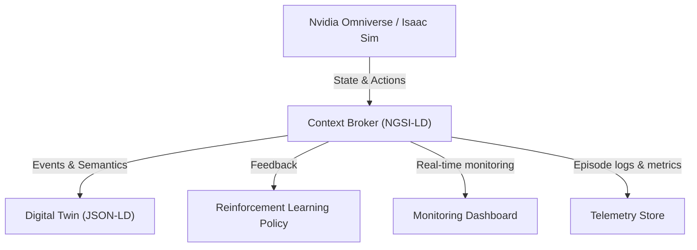

# Digital-Twin-NVIDIA-Omniverse-Robot-RL-for-Logistics

This repository is a professional blueprint to design an integrated platform to **train, validate, and prepare the deployment of mobile robots equipped with manipulator arms (pick & place)** by combining:

* a **Digital Twin / context broker** to reflect the real-time state of the warehouse;
* **NVIDIA Omniverse + Isaac Sim** for high-fidelity physics and visual simulation;
* **Reinforcement Learning (RL) agents** trained from prompts (text instructions translated into operational goals).

This repository documents the use cases, business value, target architecture, and roadmap for implementing a reproducible prototype.

---

## Context & Objectives

### Context

Modern logistics is actively seeking solutions to **automate order fulfillment, reduce errors, and improve operational resilience** without hardware risks. The combination of high-fidelity simulation and a digital twin accelerates development while reducing *sim2real* costs.

### Objectives

* Demonstrate a reproducible **RL training pipeline** in Isaac Sim for pick & place tasks.
* Provide a **proof-of-concept integration** between a context broker and the simulation.
* Document **best practices for sim2real transfer** (domain randomization, calibration, fine-tuning).

---

## Project Scope

**Included**

* Minimal Omniverse scene (warehouse, rack, mobile robot + manipulator).
* Gym-like RL environment (Isaac Sim wrapper).
* Baseline RL agent (PPO or SAC) and training/evaluation scripts.
* Simple perception module (label detection, segmentation) for pick task.
* Mock Digital Twin (MQTT / NGSI-LD) to inject inventory states.

**Excluded (future phase)**

* Full hardware integration (proprietary drivers), certifications, and industrial-scale deployment.

---

## Priority Use Cases

### Main Case — Pick & Place for Order Fulfillment

* **Description**: locate an identified box, pick it up, and place it in a collection area.
* **Example prompt**: `"Pick SKU-12345 in aisle A and drop it in zone B3."`
* **Constraints**: dynamic obstacles, lighting variations, alignment of items, fragility.

### Secondary Case — Sample Transport in Sensitive Environments

* Hospitals, laboratories: safety, traceability, and flow isolation constraints.

### Tertiary Case — Inspection & Assisted Maintenance

* Patrolling robot executing inspection prompts (thermal cameras, LiDAR).

---

## Business Value

* Lower cost per order.
* Reduced picking errors.
* Improved throughput.
* Shorter integration times.

---

## Technical Architecture (structure & placeholders)

**Goal**: provide a clear schema of components, data flows, and APIs.
*(Detailed diagrams and specifications to be added here.)*

### Conceptual Overview

* **Digital Twin / Context Broker**
  Ingests states (IoT sensors, inventory, operational events).

* **Simulation Core**
  NVIDIA Omniverse + Isaac Sim: scenes, assets, physics engines, virtual sensors.

* **RL Module**
  Gym-like environment, agents, distributed training algorithms.

* **Perception**
  Vision pipelines (label extraction, box detection, pose estimation).

* **Orchestration & Monitoring**
  Log storage, visualization (Weights & Biases), CI/CD pipelines for models.

---

## Diagrams

**Detailed interactions**

