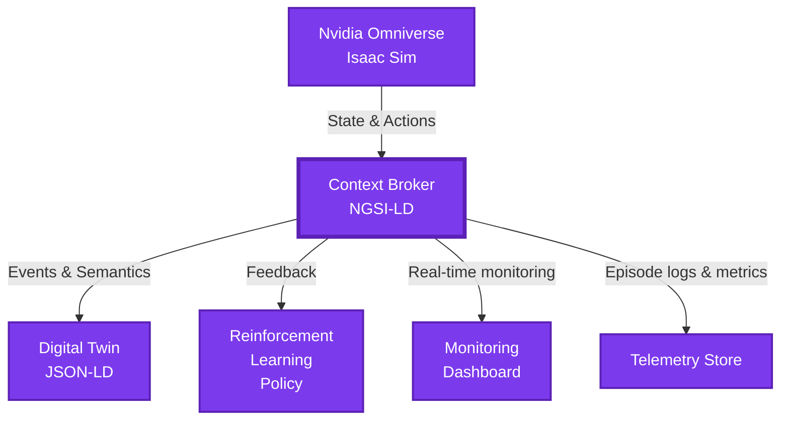

# Digital-Twin-NVIDIA-Omniverse-Robot-RL-pour-logistique

Ce projet vise à concevoir une plateforme intégrée pour entraîner, valider et préparer le déploiement de robots mobiles équipés de bras manipulateurs (pick & place) en combinant :

* un **Digital Twin / context broker** pour refléter l’état réel de l’entrepôt ;
* **NVIDIA Omniverse + Isaac Sim** pour la simulation physique et visuelle de haute fidélité ;
* des **agents Reinforcement Learning (RL)** entraînés à partir de prompts (instructions textuelles transformées en objectifs opérationnels).

Le présent dépôt sert de blueprint professionnel : il documente les cas d’usage, l’intérêt commercial, l’architecture cible et la feuille de route pour implémenter un prototype reproductible.

---

## Contexte et objectifs

**Contexte** : la logistique actuelle recherche des solutions pour automatiser la préparation de commandes, réduire les erreurs, et augmenter la résilience opérationnelle sans risque matériel. La combinaison simulation haute-fidélité + digital twin accélère le développement et réduit le coût du sim2real.

**Objectifs** :

* Démontrer un pipeline d’entraînement RL reproductible dans Isaac Sim pour des tâches pick & place.
* Fournir une intégration de preuve de concept entre context broker et simulation.
* Documenter les pratiques de transfert sim2real (domain randomization, calibration, fine-tuning).

---

## Portée du projet

**Inclus** :

* Scène Omniverse minimale (entrepôt, rack, robot mobile + bras).
* Environnement Gym-like pour entraînement RL (wrapper Isaac Sim).
* Agent RL baseline (PPO ou SAC) et scripts d’entraînement/évaluation.
* Module perceptif simple (détection d’étiquettes, segmentation) pour la tâche pick.
* Mock du Digital Twin (MQTT / NGSI-LD) pour injecter états d’inventaire.

**Exclus (phase ultérieure)** :

* Intégration matérielle complète (drivers propriétaires), certifications, et déploiement industriel à grande échelle.

---

## Cas d'usage prioritaires

### Cas principal — Pick & Place pour préparation de commandes

* **Description** : localiser un carton identifié, le saisir et le déposer en zone de collecte.
* **Prompt exemple** : *"Prendre SKU-12345 dans l'allée A et déposer en zone B3"*.
* **Contraintes** : obstacles dynamiques, variations d’éclairage, alignement des pièces, fragilité.

### Cas secondaire — Transport d’échantillons en environnements sensibles

* Hôpitaux, laboratoires : contraintes de sécurité, traçabilité et isolement des flux.

### Cas tertiaire — Inspection & maintenance assistée

* Robot patrouilleur capable d’exécuter prompts d’inspection (caméras thermiques, LiDAR).

---

## Valeur commerciale

**Valeur** : réduction du coût par commande, baisse des erreurs de prélèvement, amélioration du débit, réduction du temps d’intégration.

---

## Architecture technique (structure & espace à compléter)

> **Objectif de cette section** : fournir un schéma clair des composants, des flux de données et des API. Laisser un espace pour insérer diagrammes Mermaid / PlantUML et la spécification détaillée des endpoints.

### Vue d'ensemble (conceptuelle)

1. **Digital Twin / Context Broker**

   * Ingestion des états (capteurs IoT, inventaire, événements opérationnels).
2. **Noyau de simulation**

   * NVIDIA Omniverse + Isaac Sim : scènes, assets, moteurs physiques, capteurs virtuels.
3. **Module RL**

   * Environnement Gym-like, agentes, algorithmes d’entraînement distribués.
4. **Perception**

   * Pipelines de vision (extraction d’étiquettes, détection de boîtes, estimation de pose).
5. **Orchestration & Monitoring**

   * Stockage des logs, visualisation (Weights & Biases), pipelines CI/CD pour modèles.

### Diagramme (placeholder Mermaid)

